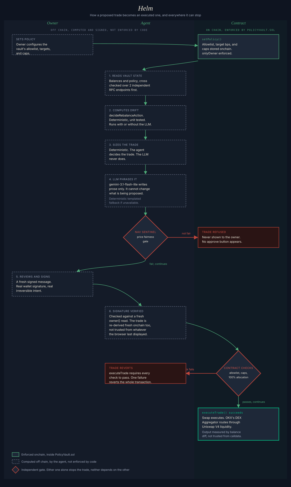

# Helm

An AI agent can hold real money without having unrestricted control over it. Helm exists to
prove that, not to prove it can trade well. It gives an agent a funded vault of tokenized US
equities on X Layer, under a constraint model instead of free rein, then builds the one
behavior that would be meaningless without a real constraint behind it. Helm refuses to
execute a trade it cannot verify is fairly priced, even when nothing else is stopping it from
going ahead.

Rebalancing is the task the agent performs day to day. It reads the vault, decides what has
drifted from target, and proposes a correction. That loop is what exercises the constraint,
but the refusal is what proves the constraint holds under real conditions, not just in the
code that describes it.

## Live

- Site, [helmfi-agent.vercel.app](https://helmfi-agent.vercel.app)
- Vault factory, [`0x0e276CC211F6e25a8Ec00222737C2e4D50145cb4`](https://www.oklink.com/x-layer/address/0x0e276CC211F6e25a8Ec00222737C2e4D50145cb4)
- Demo vault, [`0x03ceDFA7dd7E7274882fffE52d6f1a164F563d0b`](https://www.oklink.com/x-layer/address/0x03ceDFA7dd7E7274882fffE52d6f1a164F563d0b)
- Repo, [github.com/astromint-dele/helm-vault](https://github.com/astromint-dele/helm-vault)
- X, [@helm_vault](https://x.com/helm_vault)

A visitor who opens the site with no `?vault=` in the URL and no wallet connected lands on
the demo vault above, not the factory and not any other vault. The factory only enters the
picture once a visitor actually creates one.

## What anyone can do right now

Check whether any of the 717 xStocks live on X Layer is trading close to its real underlying
price, no wallet needed. Type a symbol into the public price check panel on the site and get
a real onchain quote compared against a real market price, read only, no connection, no
deposit required.

Connecting a wallet unlocks creating a real vault. Pick one of three fixed presets,
Conservative, Balanced, or Growth, and one signed transaction deploys a fresh `PolicyVault`
owned by that wallet alone. The first real vault created this way cost
[1,747,066 gas](https://www.oklink.com/x-layer/tx/0xf6af57398364cc799fbce0cff50826d806c6a6cc8af1e382b25a40e1851cdad5),
a fraction of a cent at X Layer's typical gas price. Nothing about the demo vault above is
touched, and the new vault belongs to the caller alone, immediately, in the same transaction
that creates it.

## How it works

1. The agent reads the vault's real onchain holdings and policy. Balance and allowance reads
   that drive a decision are cross-checked across two independent X Layer RPC endpoints
   before anything is trusted, never read once and assumed correct.
2. It computes drift against the target allocation and the trade that would correct it. This
   is deterministic code, `decideRebalanceAction` in `lib/rebalanceProposal.js`, unit tested
   in isolation. It runs whether or not the LLM is available, and it decides the trade. The
   LLM never does.
3. The proposed trade's price is checked against the real market. NAV Sentinel compares the
   onchain quote to the real underlying equity price. A trade the agent cannot confirm is
   fairly priced is blocked here, before a human ever sees an approve button for it. This is
   the first of two independent gates, more on both below.
4. An LLM, `gemini-3.1-flash-lite`, provider agnostic, writes a plain English explanation of
   the trade already decided in steps 2 and 3. It has no path to change what is being
   proposed, it only phrases what deterministic code already chose. If the LLM is
   unavailable, rate limited, or errors, a deterministic templated fallback produces a
   complete, accurate proposal instead. That fallback path is tested against real failures,
   not assumed to work.
5. The vault owner reviews and signs. The signature is verified server side against a fresh
   signed message, and the trade itself is re-derived from a fresh onchain read at that
   moment, not trusted from whatever the browser last displayed.
6. Execution happens only through the contract's own checks, the second of the two
   independent gates. They do not depend on or trust the agent's judgment about what is
   allowed.



Three lanes. What the owner does, what the agent computes off chain, what the contract
enforces on chain. Two independent gates sit between a proposed trade and an executed one,
NAV Sentinel off chain and the contract's own checks on chain. Either gate alone is enough to
stop a trade, neither one depends on the other.

## What is enforced onchain versus computed off chain

Enforced onchain, inside `PolicyVault.sol`, checked by the contract itself before
`executeTrade` can run.

- **Caller restriction.** Only the vault's designated agent address may call `executeTrade`,
  enforced by `onlyAgent`. Not a UI-level restriction, a modifier on the function itself.
- **Token allowlist.** Only tokens explicitly added to the vault's policy can be traded.
- **Per trade size caps.**
- **Per asset holding caps, in raw token units.** Not a percentage of portfolio value. See
  Limitations for why.
- **Allocation completeness.** `totalTargetBps` must sum to exactly 10000 across every
  allowlisted token. `executeTrade` hard reverts otherwise, meaning the agent cannot execute
  a single trade against a partially configured policy. Proven by `PolicyVault.test.js`'s
  target allocation completeness tests, not just described.
- **Owner-only withdrawals.** Only the vault's owner may withdraw any token, including ones
  the agent could never trade. Enforced by `onlyOwner` on `withdraw`, not by convention.

Computed off chain, by the agent, not enforced by the contract.

- How far the portfolio has drifted from target and which trade would correct it.
- Trade sizing.
- Whether the proposed price is fair. NAV Sentinel's result gates whether the agent will
  propose the trade at all, but the contract itself has no price awareness and cannot
  independently confirm fairness.

The contract does not know what any asset is worth and cannot, without an oracle. What it
enforces is which address may act, which assets can move, how much of them, and that the
policy governing them is complete before anything moves at all.

## Every mainnet transaction, and what each one proves

**Vault factory.** [`0x0e276CC211F6e25a8Ec00222737C2e4D50145cb4`](https://www.oklink.com/x-layer/address/0x0e276CC211F6e25a8Ec00222737C2e4D50145cb4)

| Transaction | What it proves | Gas |
|---|---|---|
| [Factory deploy](https://www.oklink.com/x-layer/tx/0x7e28ce1ec829973a85fc93f7c868d54b586d6361403fdf9a35794a7ad56f14ea) | The factory is live on mainnet, constructed with the shared agent address and the four real token addresses read live from the demo vault's own allowlist, not retyped by hand. | 1,835,445 gas at 0.0253125 gwei, 0.0000465 OKB |
| [First createVault, Balanced preset](https://www.oklink.com/x-layer/tx/0xf6af57398364cc799fbce0cff50826d806c6a6cc8af1e382b25a40e1851cdad5) | A real user-triggered vault deployment through the factory, not the demo vault. Created [`0x17e707A6510caA30455580a6760c3eC74f107875`](https://www.oklink.com/x-layer/address/0x17e707A6510caA30455580a6760c3eC74f107875), ownership transferred atomically in the same transaction. Confirmed fresh from chain, `owner()` returns the caller, `agent()` returns the shared agent, `totalTargetBps()` returns 10000. | 1,747,066 gas at 0.02 gwei, 0.0000349 OKB |

**Demo vault, deployment #5.** [`0x03ceDFA7dd7E7274882fffE52d6f1a164F563d0b`](https://www.oklink.com/x-layer/address/0x03ceDFA7dd7E7274882fffE52d6f1a164F563d0b)

| Transaction | What it proves | Gas |
|---|---|---|
| [Deployment](https://www.oklink.com/x-layer/tx/0x1e0bb6ce84474b0c5ba2b86fdb6b31914b6b6115d08d6f09694d30f6a6204273) | The live policy, 4 assets with targets summing to exactly 10000 bps, is on chain. Confirmed by reading `totalTargetBps` fresh from chain, not from script output. | 1,284,348 gas at 0.07 gwei, 0.0000899 OKB |
| [Deposit](https://www.oklink.com/x-layer/tx/0xe363788cee4b26bb30094590e7968219edc9b615679ab039e7f47df53fb43e1d) | $5.08 USDG deposited, consolidated from the prior vault plus a converted wNVDAx position. | 71,637 gas at 0.02 gwei, 0.00000143 OKB |
| [First agent trade, USDG to NVDAx](https://www.oklink.com/x-layer/tx/0xe2d4c1bb01dacd53640b6d48e9e72e81100806f928b703cee643511ede01e6d7) | The full loop end to end under the corrected policy. Real onchain read, real deterministic decision, real signed approval, real execution. | 399,110 gas at 0.02 gwei, 0.00000798 OKB |
| [Second agent trade, USDG to SPYx](https://www.oklink.com/x-layer/tx/0xfe44baf20d398f72ddbec1d646c60139f015c57c7bbe2aabf48c2e8780b76af0) | Run against the code's default vault address with no environment override, proving the deployed pipeline picks up the live vault correctly rather than only working against a hand configured one. | 418,118 gas at 0.02 gwei, 0.00000836 OKB |

### Real gas costs

Every figure above was read directly from that transaction's own receipt on X Layer's RPC,
not estimated. The most expensive single action recorded is the factory's own deploy,
1,835,445 gas. The cheapest is the demo vault's deposit, 71,637 gas. At X Layer's typical gas
price, every transaction in this project cost a fraction of a cent.

## The three presets

Every vault the factory creates starts from one of three fixed policies. Each row sums to
exactly 100%, the same completeness `PolicyVault` itself enforces before any trade can run.

| Preset | USDG | NVDAx | SPYx | xBTC |
|---|---|---|---|---|
| Conservative | 60% | 15% | 15% | 10% |
| Balanced | 40% | 25% | 20% | 15% |
| Growth | 15% | 35% | 25% | 25% |

Targets are owner-adjustable after creation through the same `setPolicy` call the demo vault
has always used. The preset only picks a sensible starting point, it is not a lock.

## Verified liquidity

Five xStocks, quoted directly against OKX's DEX Aggregator at $100 and $500, real quotes, not
estimates. The project's own gate, set before any contract code was written, was 3% price
impact or better at both sizes.

| Ticker | $100 impact | $500 impact |
|---|---|---|
| NVDAx | -0.11% | -0.21% |
| TSLAx | 0.01% | -0.04% |
| AAPLx | -0.05% | -0.11% |
| SPYx | -0.06% | -0.06% |
| MSFTx | -0.19% | -0.19% |

Every figure well inside the gate, at both sizes, for every ticker. Captured together, in one
sitting, on 2026-08-12, all three commands below run back to back, not stitched from an
earlier check. These numbers supersede the original Phase 0 verification, quotes move with
the real market, and a table built from two different days would misrepresent both days.
Re-run it yourself.

```
npm run list-tokens
npm run quotes
node scripts/03-verify-liquidity.js
```

Numbers land in `output/quotes.json` and `output/liquidity-verification.json`. The table
above came from those files, not typed in by hand.

## Integration findings

Three findings, each verified against real transactions or real RPC responses rather than
trusted from documentation, are recorded in full in [FINDINGS.md](./FINDINGS.md). OKX's own
API labels every X Layer route through this liquidity as Uniswap V3, confirmed instead to be
Uniswap V4 by computing and grepping raw event log signatures from two real mainnet swaps.
The aggregator's approval target and its execution target are different contracts, approving
the wrong one fails silently, and it broke this project's first real mainnet trade attempt
before the fix went in. X Layer's public RPC returns transient bad reads on ordinary traffic,
which is why every decision driving read in this project is cross-checked against a second,
independent endpoint.

## Limitations

Stated plainly because a reader who sees the real limits trusts the rest of this more, not
less.

- **One shared agent wallet across every vault.** Every vault the factory creates trusts the
  same agent address, not a per-vault one. A compromised agent key is a problem for every
  vault at once, not just one.
- **Only three fixed presets at creation.** A new vault's starting policy is Conservative,
  Balanced, or Growth exactly as defined in `VaultFactory.sol`, no custom targets at creation
  time. The owner can change targets afterward, but cannot choose a custom starting point.
- **No natural language policy.** The instruct box in the interface is a real UI element with
  no backend behind it yet. It does not parse an instruction or change a vault's policy.
- **No percentage of portfolio value caps enforced onchain.** Per asset caps are raw token
  unit ceilings. A live NAV Sentinel price feed exists, but only off chain, for fairness
  checking. Making a percentage cap enforceable onchain means the contract has to trust a
  price source, either a real oracle or an agent pushed price with its own signature and
  staleness checks. Both are real scope and a real trust decision, not a config change, and
  neither was taken on for this build.
- **No market holiday calendar.** NAV Sentinel's market open detection is weekday and clock
  time only. It will treat a market holiday as open.
- **Wallet support is limited to injected EIP-1193 wallets** such as MetaMask. No
  WalletConnect, no mobile deep linking.

## Roadmap

Scoped by what each item actually requires, not a wishlist.

**Watch mode for any wallet.** Point Helm's price fairness and drift view at any address a
visitor connects, read only, no execution, since enforcement only exists where a
`PolicyVault` contract exists to enforce it.
Cost, 4 to 9 days. Not the frontend, that part is small. The real cost is discovering which
of 717 xStocks an arbitrary wallet even holds without a naive per-token balance call for
each one, which needs multicall batching, plus a variable target input since an arbitrary
wallet has no `PolicyVault` policy to read targets from. No new contract required, but the
discovery problem is the actual work here, not a detail.

**Custom allocations at vault creation.** Let a new vault's owner set targets directly
instead of choosing from three fixed presets.
Cost, medium. `VaultFactory.sol`'s `createVault` would need to accept and validate an
arbitrary targets array instead of an enum, the same 100% completeness check `PolicyVault`
already enforces, just supplied by the caller instead of hardcoded per preset.

**Per vault agent keys.** Let each vault's owner assign its own agent address instead of
every vault trusting the same one.
Cost, medium. A per-vault owner-settable agent already exists on `PolicyVault`, `setAgent`.
The factory would only need to stop hardcoding one shared address at creation and expose the
choice instead.

**Natural language policy.** Parse a plain English instruction into a valid policy change,
which assets, what targets, confirming it sums to 100%, and deciding what the agent should
refuse to parse rather than accept.
Cost, large. This is a trust and validation problem before it is a parsing problem. A
misread instruction acting on real money is worse than the current fixed policy, so the hard
part is the refusal logic, not the parser.

**Marketplace listing.** Packaging and listing requirements external to this codebase.
Cost, unknown, and not really ours to estimate. There is no visibility into okx.ai's own
onboarding process from the outside, a priced listing likely implies payment and KYC setup
on our side, and the timeline depends on a third party, not on engineering effort here.

## Revenue model

Helm has a real, wired mechanism for earning a share of the volume it routes, through OKX's
Builder Code fee parameters on the swap endpoint (`fromTokenReferrerWalletAddress` /
`toTokenReferrerWalletAddress` and `feePercent`, see `lib/swapBuilder.js`). Configured via
`OKX_BUILDER_FEE_PERCENT` and `OKX_BUILDER_REFERRER_ADDRESS`, capped by OKX at 3% on
non-Solana chains, deducted from the output side of the trade so the vault's own spend is
unaffected. Not enabled on the live demo vault today, since demo scale trades are not a
meaningful test of fee capture, but the mechanism is real and wired into every swap this
project executes, not a plan for later.

## Setup and run

### Environment

1. `cp .env.example .env` at the repo root and fill in `OKX_API_KEY`, `OKX_SECRET_KEY`,
   `OKX_API_PASSPHRASE`, `OKX_PROJECT_ID`. The public price check endpoint
   (`/api/price-check`, the "check any xStock" panel) needs a second, separate set from a
   second OKX project, `OKX_PUBLIC_API_KEY`, `OKX_PUBLIC_SECRET_KEY`,
   `OKX_PUBLIC_API_PASSPHRASE`, `OKX_PUBLIC_PROJECT_ID`. Public traffic to that endpoint has
   no wallet and nothing else bounding its volume, so it needs its own rate budget rather
   than sharing the vault's. Leaving these unset does not break anything else, the endpoint
   itself returns a clear 503 explaining why instead of silently falling back.
2. `cp contracts/.env.example contracts/.env`. `DEPLOYER_PRIVATE_KEY` and
   `AGENT_PRIVATE_KEY` are generated by `npm run generate-wallet` and
   `npm run generate-agent-wallet` inside `contracts/`, not typed in by hand.
3. Add `GEMINI_API_KEY` to `.env` (get one at aistudio.google.com/apikey) if you want real
   LLM phrasing rather than the deterministic fallback text.
4. `npm install` at the repo root, then `npm install` inside `web/` for the frontend.

### Phase 0 scripts, verify OKX gives the product what it needs

```
npm run list-tokens               # lists xStock-like tokens plus xBTC on X Layer
npm run quotes                    # live NVDAx and xBTC quotes, needs list-tokens run first
node scripts/03-verify-liquidity.js   # live TSLAx, AAPLx, SPYx, MSFTx quotes at $100 and $500
```

### Agent loop

```
npm run agent-loop                      # real loop, real approval prompt, real execution
npm run test-agent-loop-approval        # single cycle, auto-answers the prompt, for testing
```

Configurable via `VAULT_ADDRESS`, `AGENT_LOOP_INTERVAL_MS`, `DRIFT_THRESHOLD_PCT`,
`AGENT_LOOP_MAX_CYCLES`, `LLM_PROVIDER`, `LLM_MODEL`, `LLM_CACHE_TTL_MS`,
`LLM_MIN_INTERVAL_MS`, `NAV_WARN_THRESHOLD_PCT`, `NAV_BLOCK_THRESHOLD_PCT`.

### Frontend

`web/` is a separate Next.js app inside this repo, reading `lib/*.js` directly rather than
reimplementing any of it, so drift math, trade sizing, and NAV Sentinel logic live in exactly
one place regardless of whether the caller is the CLI agent loop or the web app.

```
cd web && npm run dev
```

`web/.env.example` includes `NEXT_PUBLIC_VAULT_FACTORY_ADDRESS`, the factory address the
create-vault flow calls. It defaults to the live mainnet factory above if unset.

### Deploy to Vercel

GitHub repo and Vercel project name are allowed to differ and do here, repo is `helm-vault`,
Vercel project is `helmfi-agent`, since the deployed URL follows the Vercel project name, not
the repo name.

1. Set **Root Directory** to `web` in the Vercel project's settings.
2. Set every environment variable listed in `web/.env.example` under Project Settings then
   Environment Variables. The two `.env` files this app reads locally are both gitignored and
   never reach Vercel's filesystem, so production relies entirely on dashboard-configured
   variables.
3. Deploy, then set the production alias explicitly. A CLI deploy does not auto-repoint a
   custom domain.

```
npx vercel --prod --yes
npx vercel alias set <the-new-deployment-url> helmfi-agent.vercel.app
```
